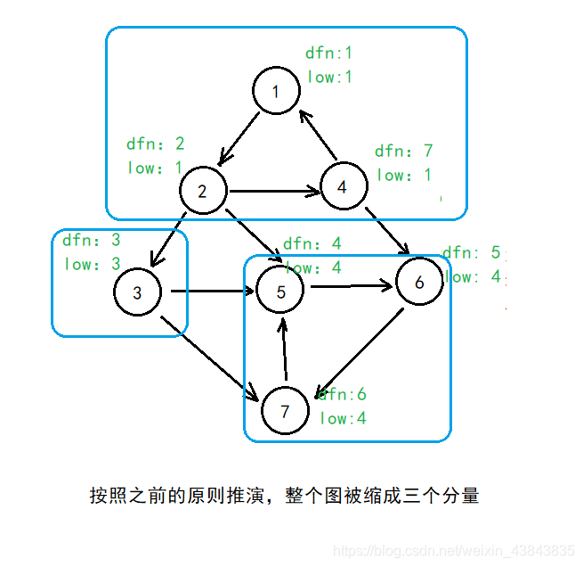

## 强连通分量Tarjan算法
#### 基本思想
首先考虑强连通分量的性质，即存在一条回路能从初始点又回到初始点。在这个查找的过程中，可以对经过的结点标记，当发现某一节点连向的点正好以及被标记过，则说明找到了一条回路，而这个回路上的所有点构成一个强连通分量。我们以dfs为算法主体去找这样的回路。
#### 实现思路
先定义：
1. dfn[i]表示第一次遍历到第i号节点时的时间/次序，即时间戳
2. low[i]表示当前i所在dfs子树的节点**最多经过一条非树边**能到达的最小dfs序（这是理解整个算法的关键。但对于low数组的定义，还有一个微妙的地方，在后面会谈到）。
3. st栈存储当前访问过的节点中没有形成回路（也就是说没有完全确定下来它所代表的强连通分量）的节点，这意味着一但形成回路，就要将若干节点弹出。

代码如下：
~~~
void sccdfs(int u){//Tarjan算法
    st.push(u);
    low[u]=dfn[u]=++t;
    inStack[u]=true;
    visited[u]=true;
    int l=To[u].size();
    for(int i=0;i<l;i++){
        int v=To[u][i];
        if(!visited[v]){//树边
            sccdfs(v);
            low[u]=min(low[u],low[v]);
        }
        else if(inStack[v])//不是树边，不是横向边，也不是前向边，
                这保证了是后向边，指向u的祖先
            low[u]=min(low[u],dfn[v]);
    }
    if(low[u]==dfn[u]){
        int top;
        sccNum++;
        do{   
            top=st.top();
            inStack[top]=false;
            st.pop();
            SCCtag[top]=sccNum;
            SCCv[sccNum].push_back(top);
        }while(top!=u);
    }
}
~~~

#### 对该算法简单的理解
在dfs过程中，假设我们当前所在节点为u，下一个节点是v。当v未被访问过时，uv就是树边，我们对其进行dfs，根据low数组的定义，并且我们假定整个Tarjan算法是正确的，这样我们就可以得到low[v]的正确值，这样我们可以更新low[u]=min(low[u],low[v])。当v被访问过，uv就是后向边，根据low的定义我们应该更新low[u]=min(low[u],dfn[v])而非min(low[u],low[v]),因为low要求最多经过一条非树边。但是实际上，似乎，修改low的定义，去掉最多一条非树边的条件，只满足v是u的祖先，也能让算法正确，也即low[u]=min(low[u],dfn[v])。  
在上面不断的迭代过程中，我们能找到一条回路，回路“连接”于目前所在强连通分量的根（该强连通分量dfn最小的点），它满足low[i]=dfn[i] (而且是当且仅当的关系)。也即是说，当找到一个点满足上面那条等式，我们就把这条路径上（回路）的点全部拿出来，这些点正是存于stack中的点，直到弹到分量的根为止。

#### 相关应用与问题
缩点，双连通问题，割点割边

#### 其它
Tarjan算法比Kosaraju易于实现，而且效率高约30%。