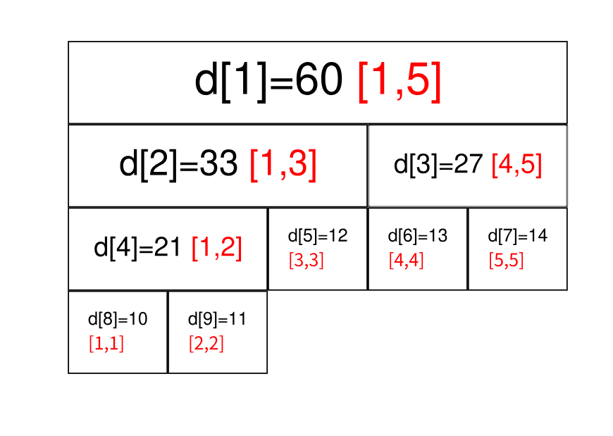

# 线段树简略教程（备忘录）
*********
***详见oiwiki***
### 定义与应用场景
线段树是算法竞赛中常用的用来维护 区间信息 的数据结构。
线段树可以在 O(log N) 的时间复杂度内实现单点修改、区间修改、区间查询（区间求和，求区间最大值，求区间最小值）等操作。  
线段树将每个长度不为 1 的区间划分成左右两个区间递归求解，把整个线段划分为一个树形结构，通过合并左右两区间信息来求得该区间的信息。这种数据结构可以方便的进行大部分的区间操作。

有个大小为 5 的数组 a=\{10,11,12,13,14\}，要将其转化为线段树，有以下做法：设线段树的根节点编号为 1，用数组 d 来保存我们的线段树，d_i 用来保存线段树上编号为 i 的节点的值（这里每个节点所维护的值就是这个节点所表示的区间总和）。见图：  
设d[i]节点表示区间[s,t],则它的子节点d[2*i],d[2*i+1]分别表示区间[s,s+(t-s)/2]和[s+(t-s)/2,t]
建树代码：
~~~
int getsum(int l, int r, int s, int t, int p) {
  // [l, r] 为查询区间, [s, t] 为当前节点包含的区间, p 为当前节点的编号
  if (l <= s && t <= r)
    return d[p];  // 当前区间为询问区间的子集时直接返回当前区间的和
  int m = s + ((t - s) >> 1), sum = 0;
  if (l <= m) sum += getsum(l, r, s, m, p * 2);
  // 如果左儿子代表的区间 [s, m] 与询问区间有交集, 则递归查询左儿子
  if (r > m) sum += getsum(l, r, m + 1, t, p * 2 + 1);
  // 如果右儿子代表的区间 [m + 1, t] 与询问区间有交集, 则递归查询右儿子
  return sum;
}
~~~

### 区间查询
如果要查询的区间为 [3,5]，此时就不能直接获取区间的值，但是 [3,5] 可以拆成 [3,3] 和 [4,5]，可以通过合并这两个区间的答案来求得这个区间的答案。

一般地，如果要查询的区间是 [l,r]，则可以将其拆成最多为 O(log n) 个 极大 的区间，合并这些区间即可求出 [l,r] 的答案。

代码如下：
~~~
int getsum(int l, int r, int s, int t, int p) {
  // [l, r] 为查询区间, [s, t] 为当前节点包含的区间, p 为当前节点的编号
  if (l <= s && t <= r)
    return d[p];  // 当前区间为询问区间的子集时直接返回当前区间的和
  int m = s + ((t - s) >> 1), sum = 0;
  if (l <= m) sum += getsum(l, r, s, m, p * 2);
  // 如果左儿子代表的区间 [s, m] 与询问区间有交集, 则递归查询左儿子
  if (r > m) sum += getsum(l, r, m + 1, t, p * 2 + 1);
  // 如果右儿子代表的区间 [m + 1, t] 与询问区间有交集, 则递归查询右儿子
  return sum;
}
~~~

### 区间修改与懒惰标记
如果要求修改区间 [l,r]，把所有包含在区间 [l,r] 中的节点都遍历一次、修改一次，时间复杂度无法承受。我们这里要引入一个叫做 「懒惰标记」 的东西。

懒惰标记，简单来说，就是通过延迟对节点信息的更改，从而减少可能不必要的操作次数。每次执行修改时，我们通过打标记的方法表明该节点对应的区间在某一次操作中被更改，但不更新该节点的子节点的信息。实质性的修改则在***下一次访问***（访问可以是修改也可以是查询）带有标记的节点时才进行。

区间修改代码如下：
~~~
void update(int l, int r, int c, int s, int t, int p) {
  // [l, r] 为修改区间, c 为被修改的元素的变化量, [s, t] 为当前节点包含的区间, p
  // 为当前节点的编号
  if (l <= s && t <= r) {
    d[p] += (t - s + 1) * c, b[p] += c;
    return;
  }  // 当前区间为修改区间的子集时直接修改当前节点的值,然后打标记,结束修改
  int m = s + ((t - s) >> 1);
  if (b[p] && s != t) {
    // 如果当前节点的懒标记非空,则更新当前节点两个子节点的值和懒标记值
    d[p * 2] += b[p] * (m - s + 1), d[p * 2 + 1] += b[p] * (t - m);
    b[p * 2] += b[p], b[p * 2 + 1] += b[p];  // 将标记下传给子节点
    b[p] = 0;                                // 清空当前节点的标记
  }
  if (l <= m) update(l, r, c, s, m, p * 2);
  if (r > m) update(l, r, c, m + 1, t, p * 2 + 1);
  d[p] = d[p * 2] + d[p * 2 + 1];
}
~~~
添加了懒惰标记后的区间查询代码如下：
~~~
int getsum(int l, int r, int s, int t, int p) {
  // [l, r] 为查询区间, [s, t] 为当前节点包含的区间, p 为当前节点的编号
  if (l <= s && t <= r) return d[p];
  // 当前区间为询问区间的子集时直接返回当前区间的和
  int m = s + ((t - s) >> 1);
  if (b[p]) {
    // 如果当前节点的懒标记非空,则更新当前节点两个子节点的值和懒标记值
    d[p * 2] += b[p] * (m - s + 1), d[p * 2 + 1] += b[p] * (t - m);
    b[p * 2] += b[p], b[p * 2 + 1] += b[p];  // 将标记下传给子节点
    b[p] = 0;                                // 清空当前节点的标记
  }
  int sum = 0;
  if (l <= m) sum = getsum(l, r, s, m, p * 2);
  if (r > m) sum += getsum(l, r, m + 1, t, p * 2 + 1);
  r
~~~

### 动态开点线段树
前面讲到堆式储存的情况下，需要给线段树开 4n 大小的数组。为了节省空间，我们可以不一次性建好树，而是在最初只建立一个根结点代表整个区间。当我们需要访问某个子区间时，才建立代表这个区间的子结点。这样我们不再使用 2p 和 2p+1 代表 p 结点的儿子，而是用 ls和 rs 记录儿子的编号。总之，动态开点线段树的核心思想就是：结点只有在有需要的时候才被创建。

### 其它
合并与分裂。。。