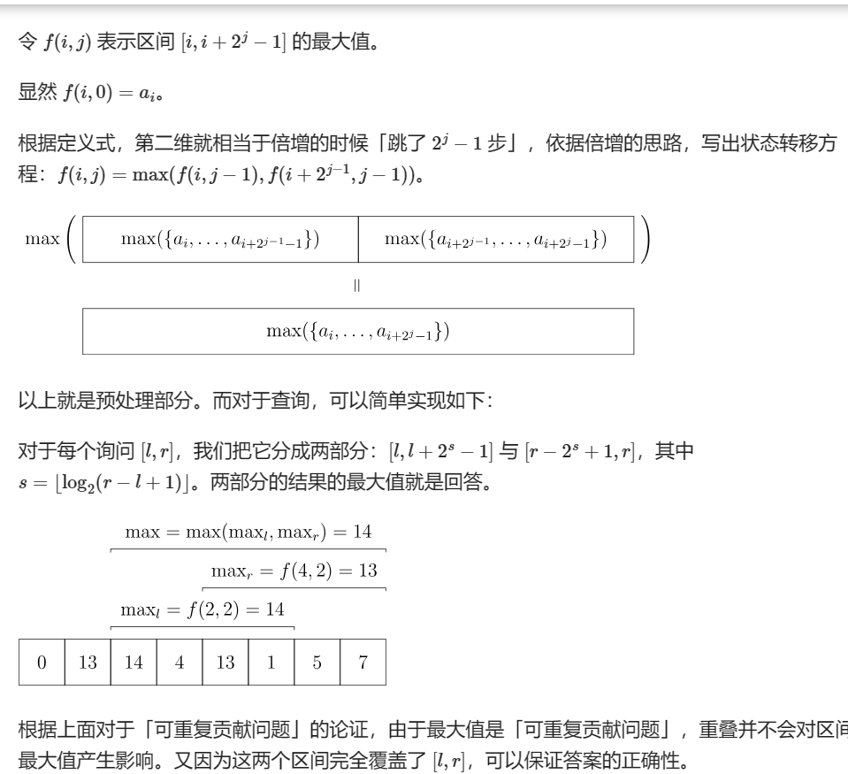

## 稀疏表ST
#### 定义以及适用范围
ST 表是用于解决 可重复贡献问题 的数据结构。可重复贡献问题 是指对于运算opt，满足 x opt x=x，则对应的区间询问就是一个可重复贡献问题。例如，最大值有 max(x,x)=x，gcd 有gcd(x,x)=x，所以 RMQ 和区间 GCD 就是一个可重复贡献问题。像区间和就不具有这个性质，如果求区间和的时候采用的预处理区间重叠了，则会导致重叠部分被计算两次，这是我们所不愿意看到的。另外，opt还必须满足结合律才能使用 ST 表求解。(RMQ 是英文 Range Maximum/Minimum Query 的缩写，表示区间最大（最小）值。)
ST 表基于 倍增 思想，可以做到 Theta(nlog n) 预处理，Theta(1) 回答每个询问。但是不支持修改操作(其实也是可以支持的，而且与样板代码相比没有太大改变，详见luoguP1198)。
#### 具体实现
见  
#### 代码
~~~
#include <bits/stdc++.h>
using namespace std;
const int logn = 21;
const int maxn = 2000001;
int f[maxn][logn + 1], Logn[maxn + 1];

int read() {  // 快读
    ...//not important
}

void pre() {  // 准备工作，初始化
  Logn[1] = 0;
  Logn[2] = 1;
  for (int i = 3; i < maxn; i++) {
    Logn[i] = Logn[i / 2] + 1;
  }
}

int main() {
  int n = read(), m = read();
  for (int i = 1; i <= n; i++) f[i][0] = read();
  pre();
  for (int j = 1; j <= logn; j++)
    for (int i = 1; i + (1 << j) - 1 <= n; i++)
      f[i][j] = max(f[i][j - 1], f[i + (1 << (j - 1))][j - 1]);  // ST表具体实现
  for (int i = 1; i <= m; i++) {
    int x = read(), y = read();
    int s = Logn[y - x + 1];
    printf("%d\n", max(f[x][s], f[y - (1 << s) + 1][s]));
  }
  return 0;
}
~~~
#### 样题
luoguP1198
